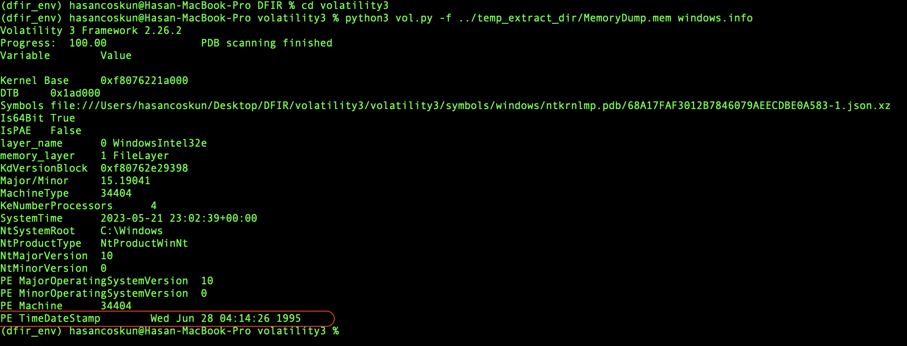
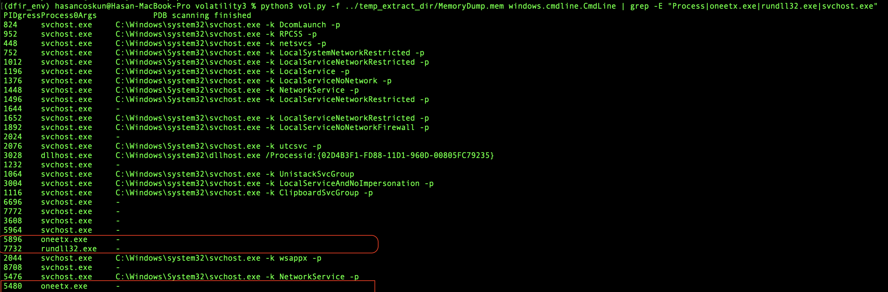
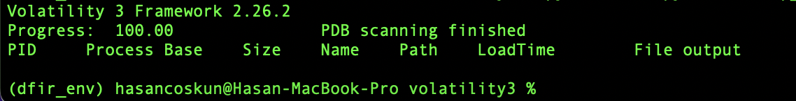
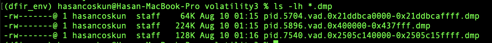
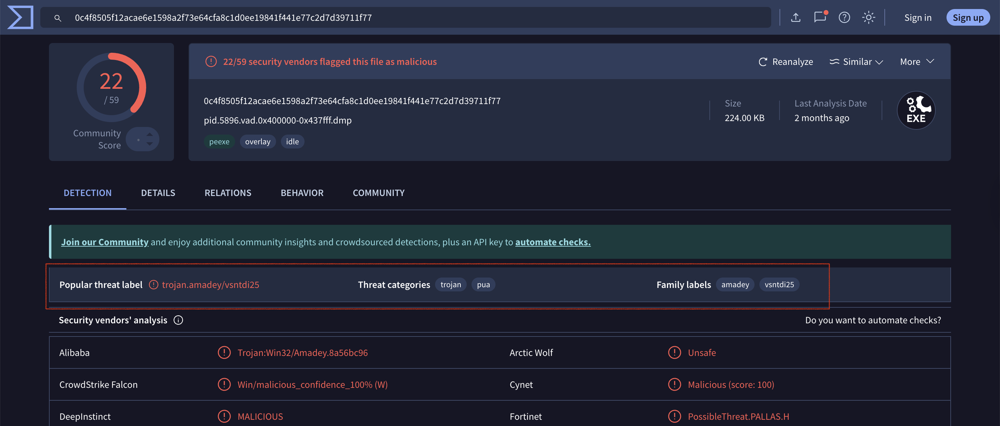
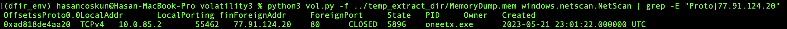
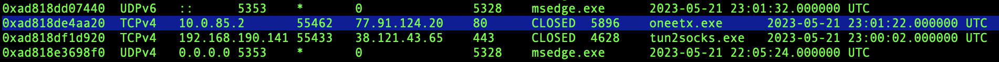
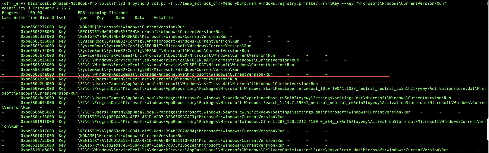
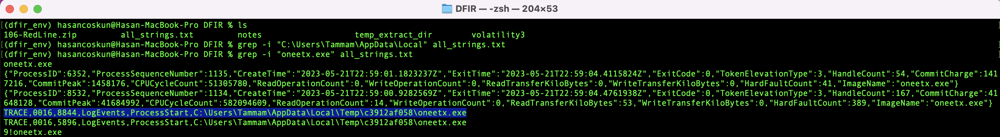

# Case Study: In‑Depth Memory Forensics of an Amadey Trojan Infection

[](./LICENSE)


[](https://github.com/iamhasancoskun)

English (this page) | [Türkçe](README.md)

| Category | Details |
| :--- | :--- |
| Focus | Memory Forensics, Anti‑Forensics, Threat Intelligence |
| Evidence | `MemoryDump.mem` (Windows 10 x64, 2 GB) |
| Tooling | Volatility 3, `strings`, `grep`, VirusTotal |

---

## 1. Executive Summary
Using the Volatility 3 framework, I performed a memory forensics investigation on a Windows 10 x64 image and confirmed an infection by the **Amadey Trojan**. The adversary employed **Process Hollowing** and **PEB Unlinking** to evade standard inspection. The analysis also uncovered the malware’s **C2 communications** and **registry‑based persistence**, allowing attribution of its full on‑disk path.

---

## 2. Technical Analysis (Hypothesis‑Driven)
Each step states a hypothesis and the test used to validate or refute it.

### Phase 1 — System Profiling
- Hypothesis: Baseline OS/machine details may reveal obvious anomalies.
- Command: `python3 vol.py -f ... windows.info`
- Finding: OS is **Windows 10 x64**. The kernel’s `PE TimeDateStamp` appears as **1995**, suggesting potential **Timestomping (T1070.006)**.



> Note: A 1995 PE TimeDateStamp is implausible for Windows 10. This typically indicates backdating/timestomp; less commonly a parser/packer artifact. Validate via MFT ($STANDARD_INFORMATION vs $FILE_NAME), Prefetch execution times, and Registry (UserAssist, ShimCache, Run).


### Phase 2 — Process Reconnaissance
- Hypothesis: Malicious behavior should surface in process listings/relationships.
- Command: `python3 vol.py -f ... windows.pslist | grep -E "ImageFileName|oneetx.exe|rundll32.exe"`
- Finding: Two suspects:
  1. **`oneetx.exe` (PID 5896)** — non‑standard binary spawning `rundll32.exe`.
  2. **`rundll32.exe` (PID 7732)** — legitimate tool frequently abused by malware.


### Phase 3 — Anti‑Forensics Evidence
- Hypothesis: The suspects attempt to hide from standard inspections.
- Evidence A — Process Hollowing (`windows.cmdline`): `oneetx.exe` shows an empty command line, consistent with **Process Hollowing (T1055.012)**.



- Evidence B — PEB Unlinking (`windows.dlllist`): `rundll32.exe` (PID 7732) returns an empty DLL list, indicating **PEB Unlinking**.



### Phase 4 — Extracting and Identifying Injected Code
- Hypothesis: Direct memory inspection should reveal an injected PE region.
- Command: `python3 vol.py -f ... windows.malware.malfind --dump`
- Finding: `malfind` locates an `MZ` region with `PAGE_EXECUTE_READWRITE` inside `oneetx.exe`. The dump (`pid.5896...dmp`) was uploaded to VirusTotal and identified as **Amadey Trojan**.





### Phase 5 — C2 and Persistence Discovery
- Evidence A — C2 (`windows.netscan`): `oneetx.exe` connects to the C2 **`77.91.124.20`** over **port 80**.




- Evidence B — Persistence + Full Path (`windows.registry.printkey`): Auto‑start via the user’s `Run` key. Combined with `strings`, the full path is: `C:\\Users\\Tammam\\AppData\\Local\\Temp\\c3912af058\\oneetx.exe`.



#### Full Path from Strings


---

## 3. Findings & IOCs
| Type | Value |
|---|---|
| Malware Family | Amadey Trojan |
| File Path | `C:\\Users\\Tammam\\AppData\\Local\\Temp\\c3912af058\\oneetx.exe` |
| SHA‑256 (Injected) | `0c4f8505f12acae6e1598a2f73e64cfa8c1d0ee19841f441e77c2d7d39711f77` |
| C2 IP | `77.91.124.20:80` |
| C2 URL | `http://77.91.124.20/store/games/index.php` |
| Persistence | `HKCU\\Software\\Microsoft\\Windows\\CurrentVersion\\Run` |

Note:
- Original registry value used NT path `\\??\\C:\\Users\\Tammam\\AppData\\Local\\Temp\\c3912af058\\oneetx.exe`; in user mode this is equivalent to `C:\\...`.
- HKCU = HKEY_CURRENT_USER (the active user’s NTUSER.DAT hive).

---

## Appendix A — MITRE ATT&CK Mapping
- T1055.012 (Process Injection: Process Hollowing) — supported by `cmdline` + `malfind`.
- T1547.001 (Boot or Logon Autostart Execution: Registry Run Keys) — supported by `printkey`.
- T1070.006 (Indicator Removal: Timestomp) — anomalous `TimeDateStamp` in `windows.info`.
- T1036 (Masquerading) — generic `oneetx.exe` name and `wuapihost` registry value.

---

## Appendix B — Reproducibility & Commands
```bash
# (Optional) isolated environment
conda create --name dfir_env python=3.12 -y
conda activate dfir_env

# From repo root
python3 vol.py -f temp_extract_dir/MemoryDump.mem windows.info

# Or from volatility3 directory
cd volatility3
python3 vol.py -f ../temp_extract_dir/MemoryDump.mem windows.info
```

Batch commands:
```bash
# Processes
python3 vol.py -f temp_extract_dir/MemoryDump.mem windows.pslist

# Command lines
python3 vol.py -f temp_extract_dir/MemoryDump.mem windows.cmdline

# DLL list (for suspicious PID)
python3 vol.py -f temp_extract_dir/MemoryDump.mem windows.dlllist --pid 7732

# Malfind and dump
python3 vol.py -f temp_extract_dir/MemoryDump.mem windows.malware.malfind
python3 vol.py -f temp_extract_dir/MemoryDump.mem windows.malware.malfind --dump

# Network scan
python3 vol.py -f temp_extract_dir/MemoryDump.mem windows.netscan

# Strings for C2 URL
strings temp_extract_dir/MemoryDump.mem > all_strings.txt
grep -n "77.91.124.20" all_strings.txt

# Registry — persistence
python3 vol.py -f temp_extract_dir/MemoryDump.mem \
  windows.registry.printkey --key "Microsoft\\Windows\\CurrentVersion\\Run"
```

---

Author: [iamhasancoskun](https://github.com/iamhasancoskun)
