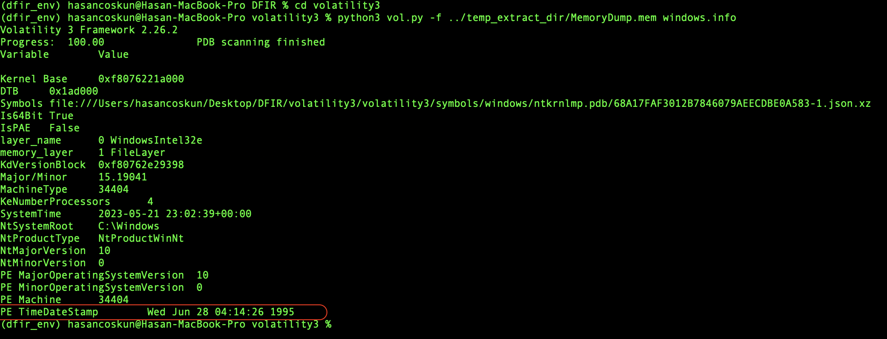
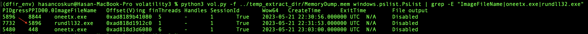
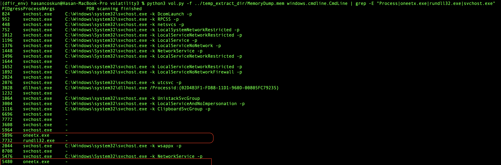
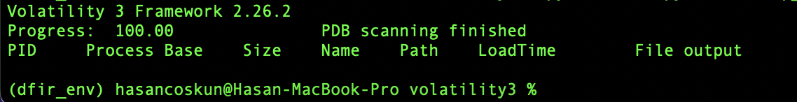
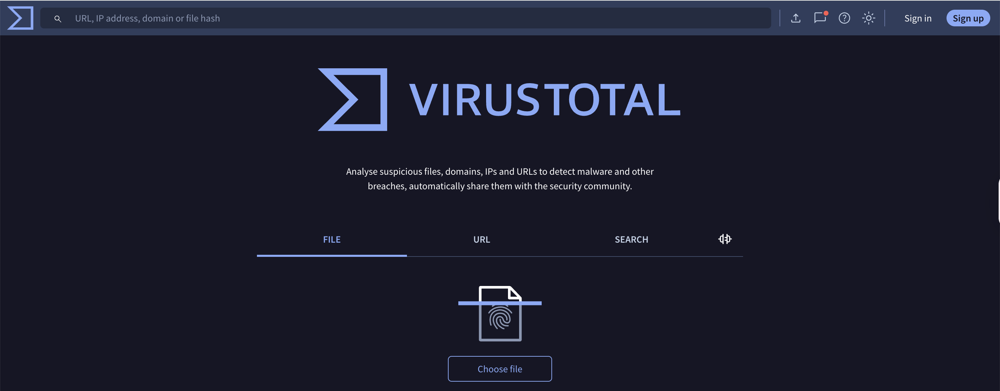
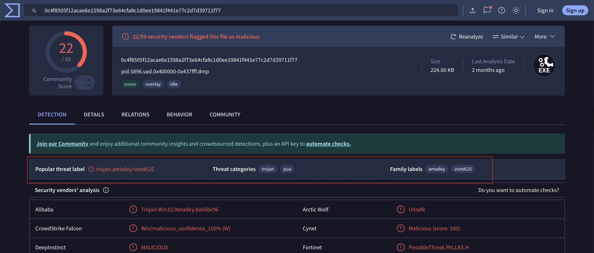
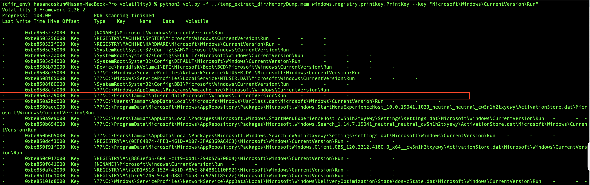
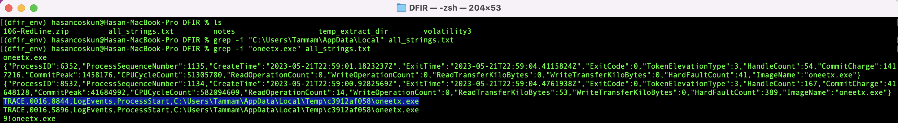

English ([README.en.md](README.en.md)) | Türkçe (this page)

# Vaka Analizi: Bir Amadey Trojan Enfeksiyonunun Derinlemesine Hafıza Adli Bilişimi

[](./LICENSE)


[](https://github.com/iamhasancoskun)

**Yazar:** Hasan Coşkun  
**Tarih:** 07 Ağustos 2025  
**Platform:** [CyberDefenders](https://cyberdefenders.org/)  
**Vaka:** [Redline (Memory Forensics)](https://cyberdefenders.org/blueteam-ctf-challenges/redline/)

| Kategori | Açıklama |
| :--- | :--- |
| **Odak Alanı** | Hafıza Adli Bilişimi, Anti-Forensics Teknikleri, Tehdit İstihbaratı |
| **Delil** | `MemoryDump.mem` (Windows 10 x64, 2 GB) |
| **Ana Araçlar** | Volatility 3, `strings`, `grep`, VirusTotal |

---

## 1. Özet (Executive Summary)
Bu rapor, bir Windows 10 sistemine ait bellek imajı üzerinde gerçekleştirilen derinlemesine adli bilişim analizinin bulgularını sunmaktadır. **Volatility 3 Framework** kullanılarak yapılan inceleme sonucunda, sistemin **Amadey Trojan** ile enfekte olduğu ve saldırganın tespitten kaçınmak amacıyla **Process Hollowing** ve **PEB Unlinking** gibi ileri seviye gizlenme teknikleri kullandığı kanıtlanmıştır. Analiz sürecinde, zararlının Komuta & Kontrol (C2) sunucusu ile olan ağ iletişimi ortaya çıkarılmış ve Windows Kayıt Defteri (Registry) üzerinde bıraktığı kalıcılık (persistence) izi takip edilerek disk üzerindeki tam konumu tespit edilmiştir.

---

## 2. Adım Adım Teknik Analiz Süreci
Bu analiz, her adımda bir hipotez kurup, bu hipotezi test etmek için ilgili aracı seçerek ilerleyen "Hipotez Odaklı Yaklaşım" ile yürütülmüştür.

### Faz 1: İlk Değerlendirme ve Sistem Kimliği Tespiti
**Hipotez:** Bellek imajının temel özelliklerini (işletim sistemi, mimari) öğrenerek analize bir başlangıç noktası belirlemek ve bariz anormallikleri tespit etmek.

- Komut: `python3 vol.py -f ... windows.info`
- Bulgular: Sistemin **Windows 10 x64** olduğu teyit edildi. İlk dikkat çekici anormallik, çekirdek dosyasının PE Zaman Damgası'nın (`PE TimeDateStamp`) **1995** yılını göstermesiydi. Bu, saldırganın dosya tarihlerini manipüle ederek analistleri yanıltmayı amaçlayan **Timestomping (T1070.006)** tekniğini kullanmış olabileceğine dair güçlü bir işarettir.



### Faz 2: Süreç Analizi ve İlk Şüphelilerin Belirlenmesi
**Hipotez:** Sistemde, zararlı aktiviteye işaret eden anormal süreçler veya süreç ilişkileri bulunmalıdır.

- Komut: `python3 vol.py -f ... windows.pslist | grep -E "ImageFileName|oneetx.exe|rundll32.exe"`
- Bulgular: Süreç listesi incelendiğinde iki ana şüpheli ortaya çıktı:
  1. **`oneetx.exe` (PID 5896):** Standart bir Windows süreci olmaması ve `rundll32.exe`'yi başlatması nedeniyle birincil şüpheliydi.
  2. **`rundll32.exe` (PID 7732):** `oneetx.exe` tarafından başlatılmıştı ve zararlılar tarafından sıkça kötüye kullanıldığı bilinen meşru bir süreçti.

Bu ebeveyn-çocuk ilişkisi, analizin bu ikili üzerine odaklanmasını gerektirdi.



### Faz 3: Gelişmiş Gizlenme (Anti-Forensics) Tekniklerinin Kanıtlanması
**Hipotez:** Şüpheli süreçlerin davranışları, standart analiz araçlarını atlatmaya yönelik manipülasyonlar içerecektir.

- Kanıt A: Process Hollowing (`windows.cmdline`)  
Boş komut satırları, `oneetx.exe`'nin normal bir şekilde başlatılmadığını, içinin oyularak zararlı kodla doldurulduğunu gösterdi. Bu, **Process Hollowing (T1055.012)** tekniğinin kanıtıydı.



- Kanıt B: PEB Unlinking (`windows.dlllist`)  
`rundll32.exe` (PID 7732) için DLL listesinin tamamen boş dönmesi, saldırganın sürecin resmi DLL listesini (PEB) manipüle ederek `dlllist` gibi araçları aldattığını kanıtladı.



### Faz 4: Enjekte Edilmiş Kodun Çıkarılması ve Tanımlanması
**Hipotez:** Madem standart listeler aldatıcı, sürecin ham bellek alanı taranarak enjekte edilmiş kod doğrudan bulunabilir ve kimliği teşhis edilebilir.

- Komut: `python3 vol.py -f ... windows.malware.malfind --dump`
- Bulgular: `malfind`, `oneetx.exe` içinde `PAGE_EXECUTE_READWRITE` (RWX) korumalı ve `MZ` imzalı bir bölge bularak Process Hollowing'i doğruladı. `--dump` parametresi ile bu bölge `pid.5896...dmp` olarak diske kaydedildi.


- Tehdit Tanımlaması: Dump edilen dosyanın VirusTotal'da analiz edilmesi, zararlının **Amadey Trojan** olduğunu teyit etti.




### Faz 5: Ağ İletişimi ve Kalıcılık Mekanizmalarının Keşfi
- Kanıt A: C2 İletişimi (`windows.netscan`)  
`netscan` analizi, `oneetx.exe` sürecinin Komuta & Kontrol (C2) sunucusu olan **`77.91.124.20`** IP adresine **port 80** üzerinden bağlandığını ortaya çıkardı.


- Kanıt B: Kalıcılık ve Tam Dosya Yolu (`windows.registry.printkey`)  
Zararlının, sistem yeniden başlatıldığında hayatta kalmak için `Tammam` kullanıcısının **`HKCU\\...\\Run`** anahtarını kullandığı tespit edildi. Bu ipucu, bellekteki `strings` kalıntılarıyla birleştirildiğinde, zararlının disk üzerindeki tam yolu ortaya çıktı: `C:\\Users\\Tammam\\AppData\\Local\\Temp\\c3912af058\\oneetx.exe`.



#### Strings ile Tam Yol Görselleştirme
`strings`/`grep` analizi sonucu, tam yolun terminal çıktısı ekran görüntüsü:



---

## 3. Sonuç ve Göstergeler (Indicators of Compromise - IOCs)
Bu analiz, Amadey Trojan'ın gizlenme, ağ iletişimi ve kalıcılık yöntemlerini başarıyla ortaya çıkarmıştır.

| Tür | Değer |
|---|---|
| **Zararlı Ailesi** | Amadey Trojan |
| **Dosya Yolu** | `\\??\\C:\\Users\\Tammam\\AppData\\Local\\Temp\\c3912af058\\oneetx.exe` (=`C:\\Users\\Tammam\\AppData\\Local\\Temp\\c3912af058\\oneetx.exe`) |
| **SHA-256 (Enjekte)** | `0c4f8505f12acae6e1598a2f73e64cfa8c1d0ee19841f441e77c2d7d39711f77` |
| **C2 IP Adresi** | `77.91.124.20:80` |
| **C2 URL** | `http://77.91.124.20/store/games/index.php` |
| **Kalıcılık** | `HKCU\\Software\\Microsoft\\Windows\\CurrentVersion\\Run` |

> Not: Orijinal registry değerinde NT path biçimi `\\??\\C:\\Users\\Tammam\\AppData\\Local\\Temp\\c3912af058\\oneetx.exe` kullanılmıştır; kullanıcı-modunda `C:\\` ile eşdeğerdir.
> HKCU = HKEY_CURRENT_USER (aktif kullanıcının profilindeki NTUSER.DAT hive'ı)

---

## Ek A: MITRE ATT&CK Eşleştirmesi
- **T1055.012 (Process Injection: Process Hollowing):** `cmdline` ve `malfind` bulgularıyla doğrulandı.
- **T1547.001 (Boot or Logon Autostart Execution: Registry Run Keys):** `printkey` ile kalıcılık mekanizması tespit edildi.
- **T1070.006 (Indicator Removal: Timestomp):** `windows.info`'daki PE zaman damgası anormalliği.
- **T1036 (Masquerading):** Zararlının kendini `oneetx.exe` gibi jenerik veya `wuapihost` (Registry değeri) gibi meşru bir isimle gizlemesi.

---

## Ek B: Tekrarlanabilirlik ve Komutlar
Aşağıdaki komutlar, bu depodaki dizin düzeni ile birebir çalışacak şekilde verilmiştir.

```bash
# (Opsiyonel) İzole ortam
conda create --name dfir_env python=3.12 -y
conda activate dfir_env

# Kökten çalıştırma (DFIR/ altındasınız):
python3 vol.py -f temp_extract_dir/MemoryDump.mem windows.info

# Ya da Volatility3 klasöründen:
cd volatility3
python3 vol.py -f ../temp_extract_dir/MemoryDump.mem windows.info
```

Analiz komutları (toplu):
```bash
# Süreçler
python3 vol.py -f temp_extract_dir/MemoryDump.mem windows.pslist

# Komut Satırları
python3 vol.py -f temp_extract_dir/MemoryDump.mem windows.cmdline

# DLL Listesi (şüpheli PID için)
python3 vol.py -f temp_extract_dir/MemoryDump.mem windows.dlllist --pid 7732

# Malfind ve Dump
python3 vol.py -f temp_extract_dir/MemoryDump.mem windows.malware.malfind
python3 vol.py -f temp_extract_dir/MemoryDump.mem windows.malware.malfind --dump

# Ağ Taraması
python3 vol.py -f temp_extract_dir/MemoryDump.mem windows.netscan

# Strings ile C2 URL çıkarımı
strings temp_extract_dir/MemoryDump.mem > all_strings.txt
grep -n "77.91.124.20" all_strings.txt

# Registry — Kalıcılık
python3 vol.py -f temp_extract_dir/MemoryDump.mem \
  windows.registry.printkey --key "Microsoft\\Windows\\CurrentVersion\\Run"
```

---

Yazar: [iamhasancoskun](https://github.com/iamhasancoskun)
